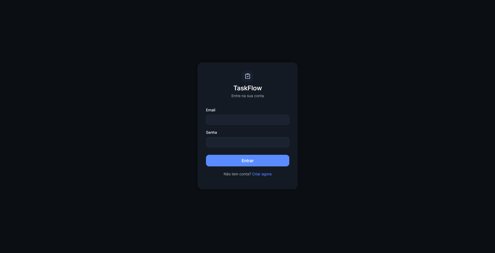
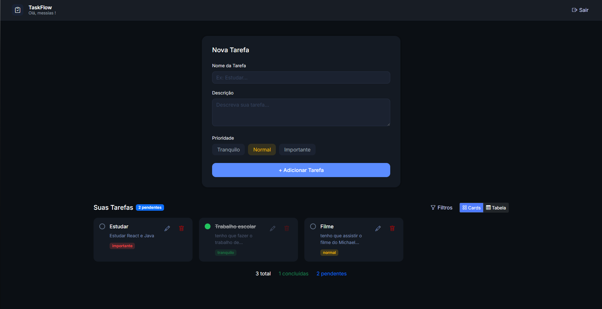
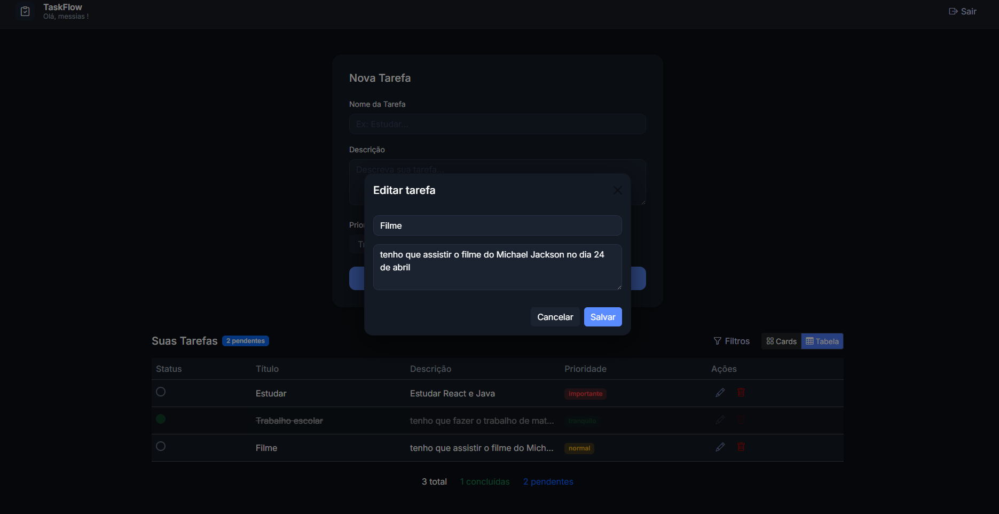
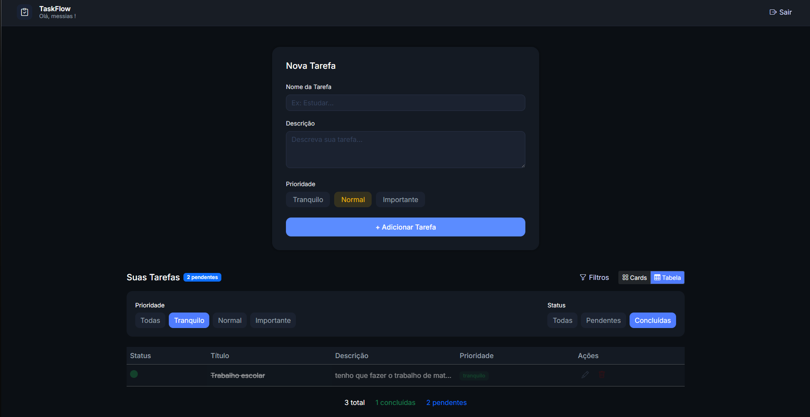

# Gerenciador de Tarefas  |  TaskFlow

Aplicação web para gerenciamento simples de tarefas, desenvolvida como projeto de aprendizado e prática em desenvolvimento Full‑Stack com Java e Spring Boot.

---

## 📌 Apresentação

* Projeto de sistema web para **criação, visualização, atualização e remoção de tarefas**.
* Interface simples e intuitiva para organização do dia a dia.
* Comunicação entre **frontend (navegador)** e **backend (API REST)**.
* Este é o meu **primeiro projeto utilizando Java e Spring Boot**.
* Projeto desenvolvido em aproximadamente **3 semanas**.

---
## ⚙️ Tecnologias Utilizadas

### Backend

* **Java**
* **Spring Boot**
* Spring Web
* Spring Data JPA
* API REST

### Frontend

* **HTML5**
* **CSS3**
* **JavaScript**
* **Bootstrap**

### DevOps / Ferramentas

* **Docker** (containerização da aplicação)
* Git
* GitHub
* Maven
* Postman


## 🧩 Funcionalidades do Sistema

* Cadastro de usuários e sistema de login
* Cada usuário visualiza apenas as **suas próprias tarefas**
* Criar, editar e excluir tarefas
* Listagem das tarefas em **formato tabela** e também em **cards**
* Filtro e pesquisa de tarefas
* As tarefas permanecem vinculadas ao usuário mesmo após sair e entrar novamente na conta
* Interface organizada utilizando Bootstrap
---

## 🔌 Comunicação da Aplicação

O sistema funciona da seguinte forma:

1. O usuário acessa a página pelo navegador
2. O JavaScript envia requisições HTTP
3. O Spring Boot recebe essas requisições
4. O backend processa e acessa o banco
5. Os dados retornam em formato JSON
6. O frontend atualiza a tela dinamicamente

---

## 🐳 Docker

O Docker foi utilizado como um servidor/ambiente de execução para rodar o projeto em container, simulando como a aplicação ficaria hospedada. A aplicação (backend Spring Boot) é empacotada em uma imagem e executada em um container, dispensando configurações locais no computador.


## 🧪 Testes com Postman

Para validar a API REST, foram realizados testes utilizando o Postman:

 * Envio de requisições GET, POST, PUT e DELETE

 * Verificação de códigos de status HTTP e respostas em JSON

 * Teste de criação, atualização, listagem e exclusão de tarefas

 * Identificação e correção de erros

---
## ▶️ Como Executar o Projeto

### Forma utilizada no desenvolvimento

1. Iniciar o **Docker** (caso o banco/ambiente esteja containerizado)
2. Abrir o projeto na IDE (ex.: IntelliJ ou VS Code)
3. Executar a aplicação Spring Boot (rodando a classe principal do projeto)
4. Acessar no navegador:

```
http://localhost:8080
```

Após iniciar o backend, a aplicação já fica disponível e o frontend passa a consumir automaticamente a API.
---

## 📚 Aprendizados

Durante a criação do projeto, foram desenvolvidas habilidades como:

* Estruturação de projetos Java
* Criação de APIs REST
* Integração entre linguagens diferentes
* Tratamento de erros HTTP
* Versionamento de código
* Organização de repositórios
* Resolução de bugs reais


---

## 📸 Demonstração do Sistema

### Login


### Tela Principal


### Editar

> Observação: Aparece um modal parecido com esse quando aperta para Deletar e Visualizar(so aperta na tarefa),

### Filtro


