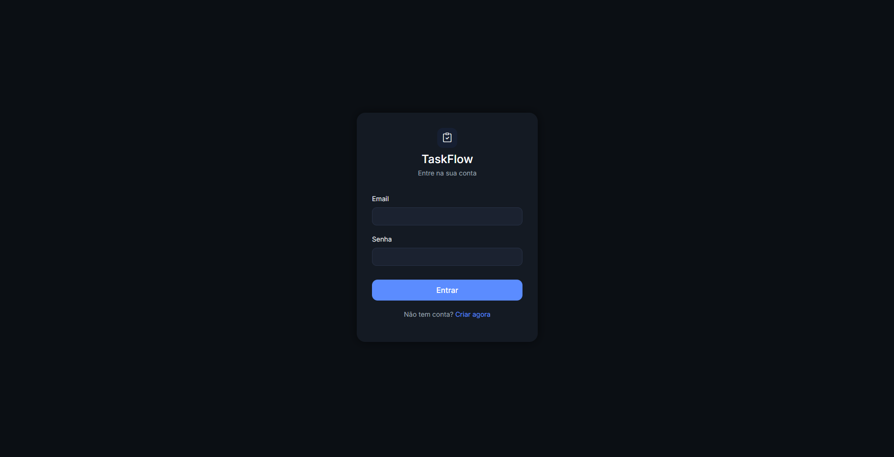
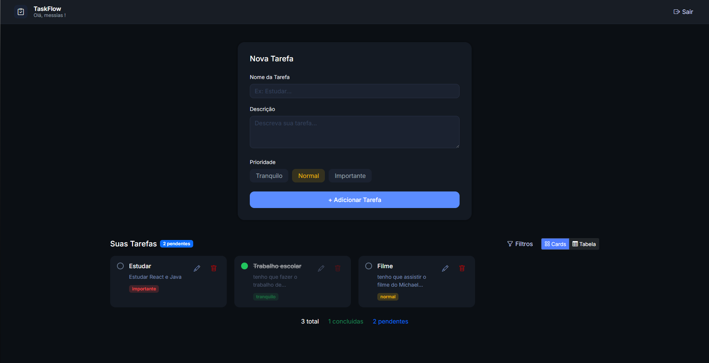
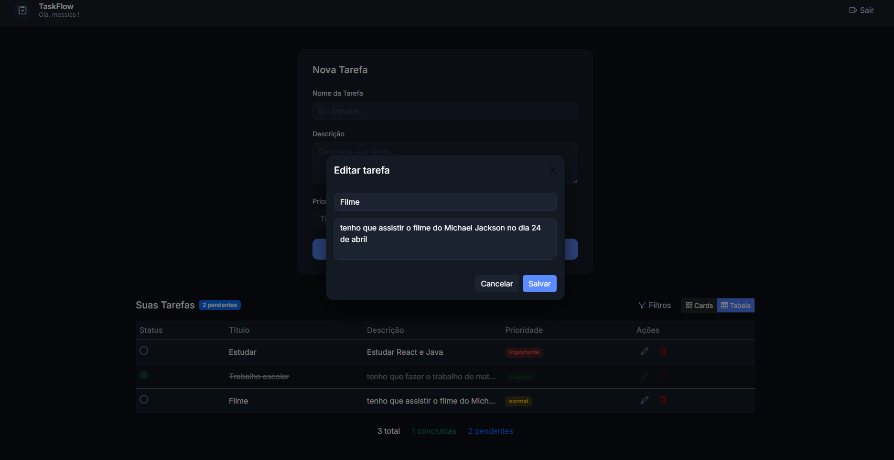
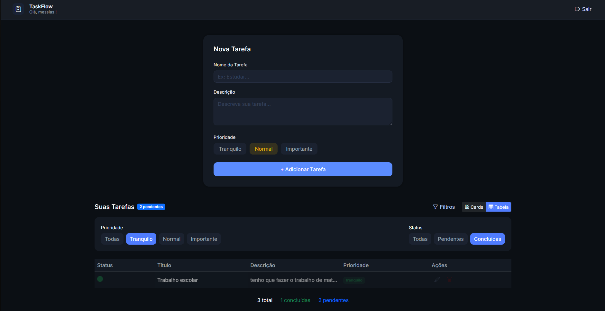

# Gerenciador de Tarefas  |  TaskFlow

Aplicação web para gerenciamento simples de tarefas, desenvolvida como projeto de aprendizado e prática em desenvolvimento Full‑Stack com Java e Spring Boot.

---

## 📌 Apresentação

* Projeto de sistema web para **criação, visualização, atualização e remoção de tarefas**.
* Interface simples e intuitiva para organização do dia a dia.
* Comunicação entre **frontend (navegador)** e **backend (API REST)**.
* Este é o meu **primeiro projeto utilizando Java e Spring Boot**.
* Projeto desenvolvido em aproximadamente **3 semanas**.

---
## ⚙️ Tecnologias Utilizadas

### Backend

* **Java**
* **Spring Boot**
* Spring Web
* Spring Data JPA
* Spring Security
* Springdoc OpenAPI
* JWT (Auth0 Java JWT)
* API REST
* Maven

### Frontend

* **HTML5**
* **CSS3**
* **JavaScript**
* **Bootstrap**

### DevOps / Ferramentas

* **Docker** (containerização da aplicação)
* Git
* GitHub
* Postman


## 🧩 Funcionalidades do Sistema

* Cadastro de usuários e sistema de login com autenticação JWT
* Cada usuário visualiza apenas as **suas próprias tarefas**
* Criar, editar, visualizar e excluir tarefas
* Marcar como concluída
* Listagem das tarefas em **formato tabela** e também em **cards**
* Filtro
* As tarefas permanecem vinculadas ao usuário mesmo após sair e entrar novamente na conta
* Interface organizada utilizando Bootstrap
---

## 🔐 Segurança e Autenticação

O sistema possui autenticação baseada em **JWT (JSON Web Token)** utilizando Spring Security.

### Como funciona:

1. O usuário realiza login
2. O backend gera um token JWT
3. O token é enviado ao frontend
4. O frontend armazena o token
5. Todas as requisições protegidas enviam o token no header:
   
   Authorization: Bearer {token}

6. O backend valida o token através de um filtro de segurança antes de processar a requisição

### Implementações realizadas:

* Configuração do Spring Security
* Criação de TokenService para geração e validação de JWT
* Filtro de autenticação
* Proteção de rotas
* Associação automática de tarefas ao usuário autenticado

## 🔌 Comunicação da Aplicação

O sistema funciona da seguinte forma:

1. O usuário acessa a página pelo navegador
2. O JavaScript envia requisições HTTP para a API
3. O backend valida o token JWT
4. A requisição é processada
5. O banco de dados é acessado via JPA
6. Os dados retornam em formato JSON
7. O frontend atualiza a tela dinamicamente

---

## 🐳 Docker

O Docker foi utilizado para containerização da aplicação, permitindo simular um ambiente de execução semelhante ao de produção.
A aplicação backend é empacotada em uma imagem Docker e executada em container.


## 🧪 Testes com Postman

Para validar a API REST, foram realizados testes utilizando o Postman:

 * Envio de requisições GET, POST, PUT e DELETE

 * Verificação de códigos de status HTTP e respostas em JSON

 * Teste de criação, atualização, listagem e exclusão de tarefas

 * Identificação e correção de erros

## 📖 Documentação da API (Swagger)
A API possui documentação interativa gerada automaticamente utilizando Springdoc OpenAPI (Swagger UI).
Para acessar documentação:
```
http://localhost:8080/swagger-ui/index.html
```
ou
```
http://localhost:8080/swagger-ui.html
```
---
## ▶️ Como Executar o Projeto

### Forma utilizada no desenvolvimento

1. Iniciar o **Docker** (caso o banco/ambiente esteja containerizado)
2. Abrir o projeto na IDE (ex.: IntelliJ ou VS Code)
3. Executar a aplicação Spring Boot (rodando a classe principal do projeto)
4. Acessar no navegador:

```
http://localhost:8080
```
5. Após iniciar o backend, a aplicação já fica disponível e o frontend passa a consumir automaticamente a API.
---

## 📚 Aprendizados

Durante a criação do projeto, foram desenvolvidas habilidades como:

* Estruturação de projetos Java
* Criação de APIs REST
* Spring Boot
* Spring Security
* Autenticação com JWT
* Criação de filtros de segurança
* Integração entre linguagens diferentes
* Tratamento de erros HTTP
* Versionamento de código
* Organização de repositórios
* Resolução de bugs reais


---

## 📸 Demonstração do Sistema

### Login


### Tela Principal


### Editar

> Observação: Aparece um modal parecido com esse quando aperta para Deletar e Visualizar(so aperta na tarefa),

### Filtro


